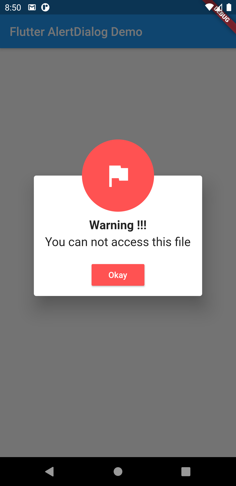
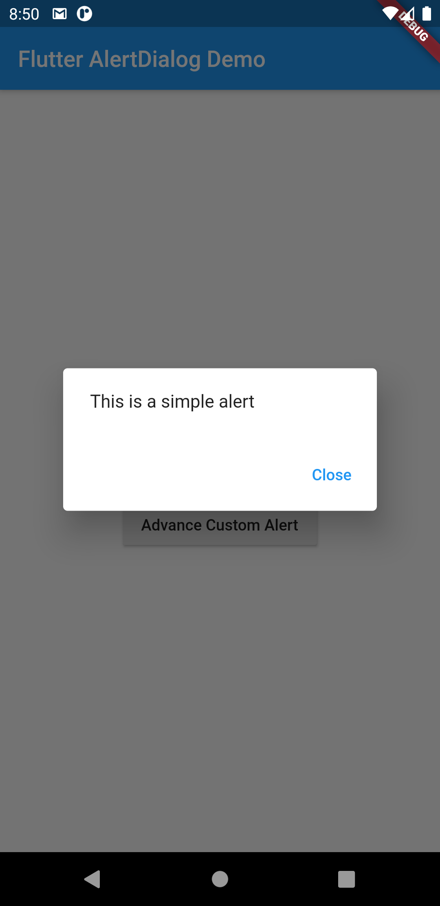
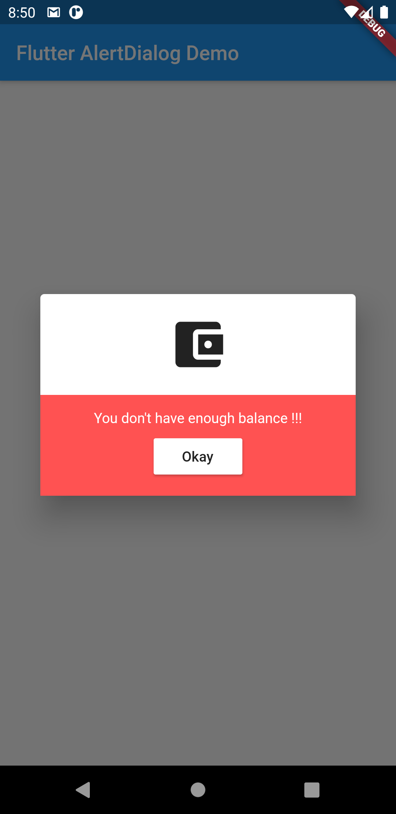

# Custom Alert Dialog in Flutter

Learn how to design custom Alert Dialog in Flutter.

## Getting Started

This project is a starting point for a Flutter application.

A few resources to get you started if this is your first Flutter project:

- [Lab: Write your first Flutter app](https://www.warmodroid.xyz/category/tutorial/flutter/)

- [Check out complete tutorial here.](https://www.warmodroid.xyz/tutorial/flutter/custom-alert-dialog-in-flutter/)

